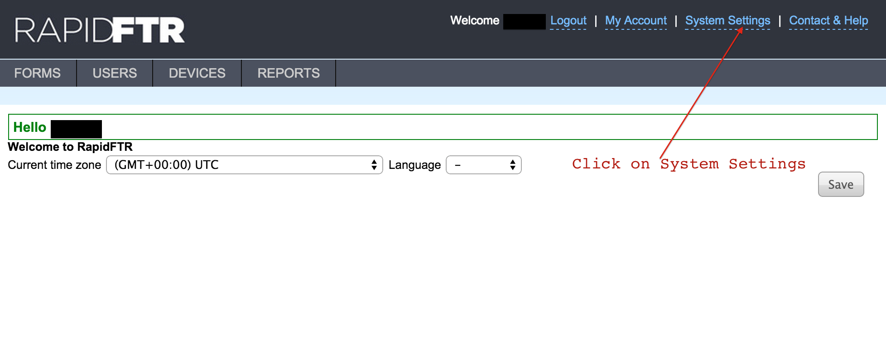
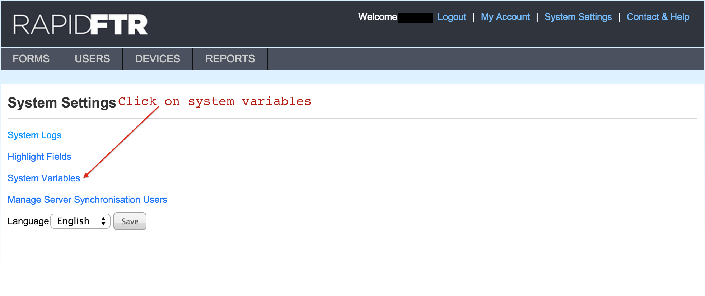
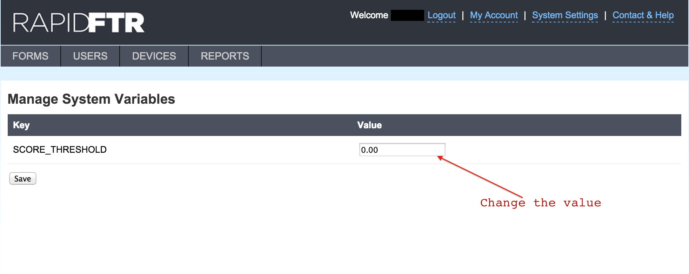
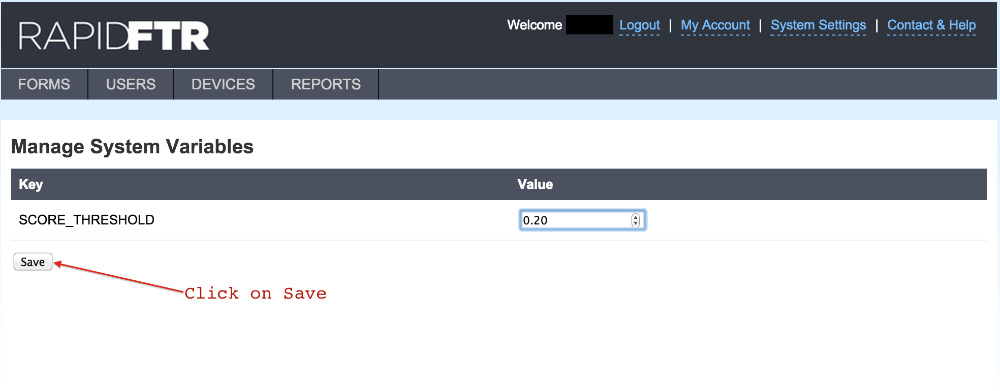

# Changing the score threshold

This functionality helps set the score threshold, which is used to ensure that the score of the potential matches displayed are higher than the threshold set. This helps return the most relevant potential matches.

Log in as admin, and then click on the system settings.

Then click on the system variables to get the Manage system variables page.

Then change the score threshold to the desired value.

Click on the save button to ensure that the change has been implemented

