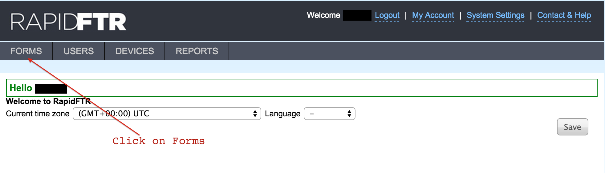
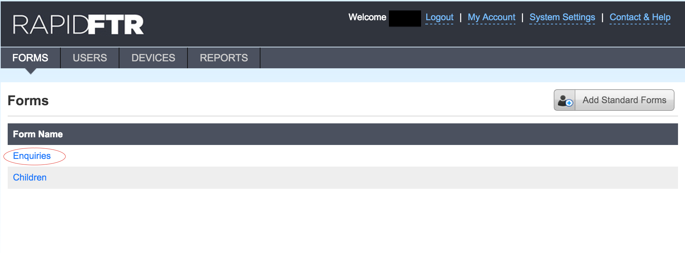
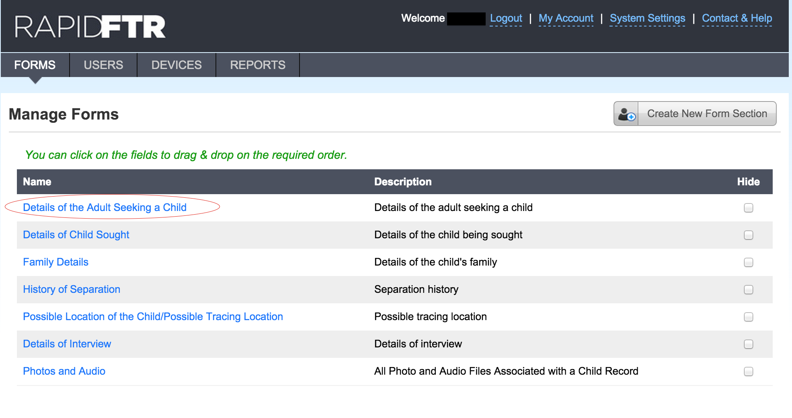
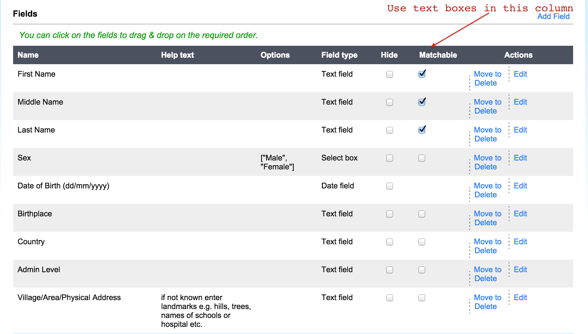

# Making Form Fields Matchable

This functionality allows you to choose which fields on an Enquiry/Child will
be used to search for a potential match.

  Log in as Administrator.
  Click the Forms tab at the top menu

 

 Click Enquiries/Child from list

 Click the desired Form Section

 

 Click the corresponding 'Matchable' checkboxes for the fields you
   want to be matchable

   
   
 Note: RapidFTR will take anywhere from a few seconds to over an hour
   to update all matches against the new fields, depending on how many
   matches exist in the system.
