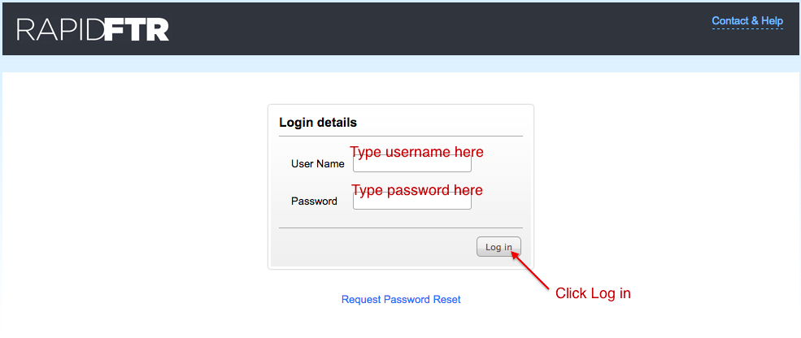

# RapidFTR Field User's Guide

Version 2.0

# 1. Mobile User's Guide

## 1.1 Device Overview

### 1.1.1 Samsung Galaxy Duos

### 1.1.2 Samsung Galaxy Fame

## 1.2 Logging into RapidFTR

To start the application, tap the RapidFTR icon shown on the home screen.

Then follow these steps:

1.	Type your username
2.	Type your password
3.	Press log in button

Once you successfully login, you will see a “Login Successful” message.

## 1.3 Registering Children

### 1.3.1 Register a new child

After you login successfully, you will be taken to “New Registration” page. If not, press the “Register” tab on top to go to “New Registration” page.

### 1.3.2 Taking a child's photo

Navigate to the form section titled **“Photos and Audio”**.

Tap on “Capture Photo” to take the photo of the child.

You will be presented with an option to “Save” or “Discard” the photo. If you are not satisfied with the photo choose “Discard” to take another photo otherwise choose “Save”. Then you will see the photo on the page.

### 1.3.3 Recording audio

Navigate to the form section titled “Photos and Audio” and tap the record button to start recording the audio.

To stop recording tap the stop button.

To play the recoded audio, tap the play button.

### 1.3.4 Saving a child's record

Always remember to **SAVE** the record before exiting or beginning a new registration. Once necessary details are entered, tap “Save” on the top right section to save the record.

### 1.3.5 Viewing child records

Go to “View All” section by tapping “View All” tab to view all children records you have registered.

All the children registered by you will be listed on “View All” tab.

Tap on the name to view a child’s record.

### 1.3.6 Editing a child's record

Tap “Edit” on the top right section of
the page to edit a record.

Make necessary changes and choose “Save” on the top right section of the page to save your changes.

## 1.4 Registering Enquiries

### 1.4.1 Register a new enquiry

Press the “Enquiry” tab on top to go to “New Enquiry” page.

### 1.4.2 Viewing enquiries

Go to “View All” section by tapping “View All” tab to view all enquiries you have registered.

All enquiries registered by you will be listed on “View All” tab.

Tap on the name to view a child’s record.

## 1.5 Navigating Forms

There are two ways to navigate multiple forms sections: Using finger swipe action & Navigating to form section through the form list menu.

### 1.5.1 Using finger swipe action

To see more fields within a form swipe the screen up or down.

To go to the **next form section** swipe the screen from **right to left**.

To go to the **previous form section** swipe from **left to right**.

### 1.5.2 Navigating to form section through the form list menu

Tap the current form section title to see the list of available form sections.

This will bring up the list of form sections available as shown in this example.

Tap on a form section title to go that form section. For example: Tap on “Separation History” to go that form section.

## 1.6 Searching

Tap “Search” on the top right section of the page to go to “Search” section.

Enter first name or nickname of the child you are looking for in the input box and tap “Go”

If there are any matching records then you will see them below the input box

If there are no matching records then you will see a message “No Record Found”

## 1.7 Synchronizing

To synchronize records go to “View all” page and press “Menu” button (refer to device overview section) on the phone.

Tap “Synchronize All” to sync all your records with the computer.

Once you tap you will see “Sync in progress” on the top of the phone

## 1.8 Logging out

Press “Menu” button (refer to device overview section) on the phone and tap “Logout” to log out of the RapidFTR application.

# 2 Web User's Guide

## 2.1 System Overview

### 2.1.1 Application menu

### 2.1.2 Quick start menu

## 2.2 Logging into RapidFTR

To start the application, enter the URL for your deployment as provided by your system administrator in your browser.

Once you enter the correct URL and press Go, you will see a login page with Username and Password fields. Then follow these steps:

1.	Type your username
2.	Type your password
3.	Press log in button

Once you successfully login, you will see the application and quick start menus on your screen.

## 2.3 Registering Children

### 2.3.1 Register a new child

To register a child, click on the Children tab in the application menu or click on the link "Register New Child" in the quick start menu.

### 2.3.2 Navigating Forms

To navigate multiple forms sections, click on the name of the section to view details of the section.

### 2.3.3 Uploading a child's photo

Navigate to the form section titled **“Photos and Audio”**.

Click on “Choose File” button to upload a photo of the child. Browse to the location of the child's photo on your computer and select the photo.

### 2.3.4 Saving a child's record

Always remember to **Save** the record before exiting or beginning a new registration. Once necessary details are entered, tap “Save” at the bottom of the section to save the record.

### 2.3.5 Editing a child's record

Tap “Edit” on the top right section of
the page to edit a record.

Make necessary changes and click on “Save” at the bottom of the page to save your changes.

### 2.3.6 Viewing child records

Click “Children” tab in the application menu to view all children records registered.

All the children registered by field workers will be listed on the page.

Click on the link to view a child’s record.

## 2.4 Registering Enquiries

### 2.4.1 Register a new enquiry

To register an enquiry, click on the Enquiries tab in the application menu, then click on "Register New Enquiry" button at the top of the page.

OR

On the home page, click on the link "Register New Enquiry" in the quick start menu.

### 2.4.2 Register a new enquiry

To register an enquiry, click on the Enquiries tab in the application menu, then click on "Register New Enquiry" button at the top of the page.

OR

On the home page, click on the link "Register New Enquiry" in the quick start menu.

### 2.4.3 Viewing enquiries

Click “Enquiries” tab in the application menu to view all enquiries.

All the enquiries registered by field workers will be listed on the page.

Click on the link to view details of the enquiry.

### 2.4.4 Viewing matches

To view the list of potential matches to an enquiry, click on the enquiry

Navigate and click on the section called **"Potential Matches"**.

You will see a list of potential matching child records to the enquiry.

### 2.4.5 Mark a child record as "Not Matching" an enquiry

To mark a child record as "Not Matching", navigate to the list of potential matches to the enquiry.

Click on the text "Mark as not matching" next to the record of the child you want to remove from the list of potential matches.

You will see a success message at the top of the page, and the child record will no longer appear in the list of potential matches.

## 2.5 Viewing change logs

To view a change log on any enquiry or child record, navigate to the detailed enquiry or child record. At the top of the page click on "Change Log" button.

You will see a description of all the changes which have been done on the child record.

## 2.5 Changing your password

To change your password, click on My Account to navigate to the account details page.

On the account details page, click on "Change Password"

## 2.5 Logging out

Press “Menu” button (refer to device overview section) on the phone and tap “Logout” to log out of the RapidFTR application.
