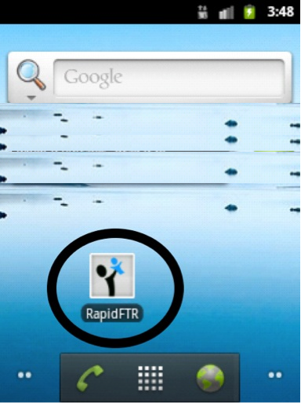
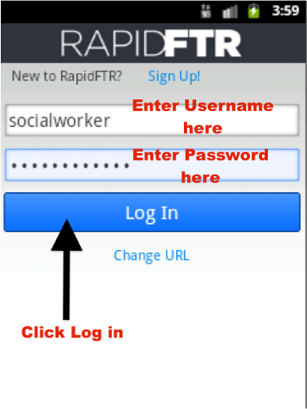
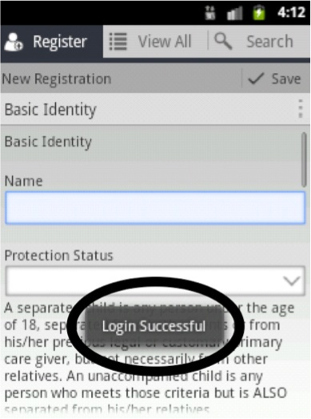

# Logging into RapidFTR

To start the application, tap the RapidFTR icon shown on the home screen.

Then follow these steps:

1.	Type your username
2.	Type your password
3.	Press log in button

Once you successfully login, you will see a “Login Successful” message.

