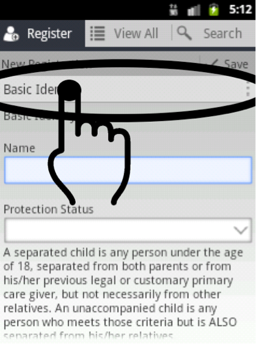
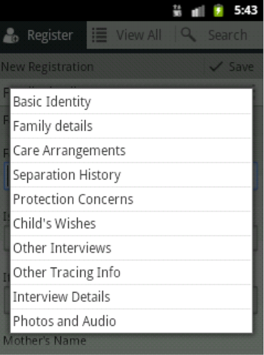
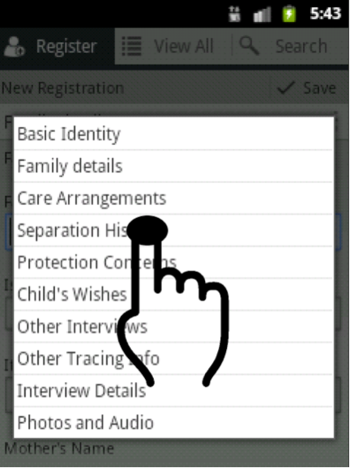

# Navigating to form section through the form list menu

Tap the current form section title to see the list of available form sections.

This will bring up the list of form sections available as shown in this example.

Tap on a form section title to go that form section. For example: Tap on “Separation History” to go that form section.

