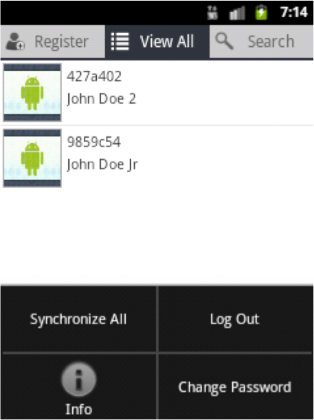
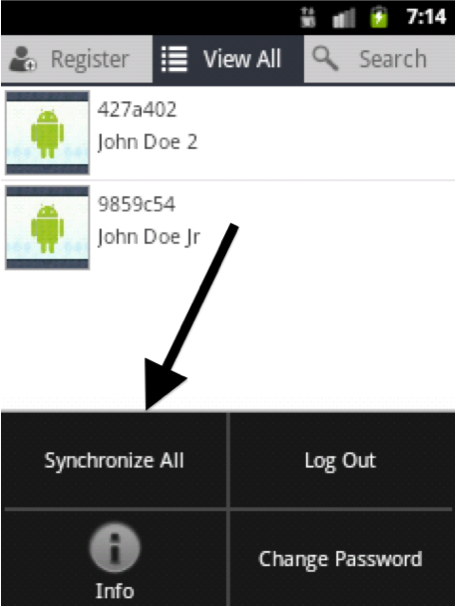
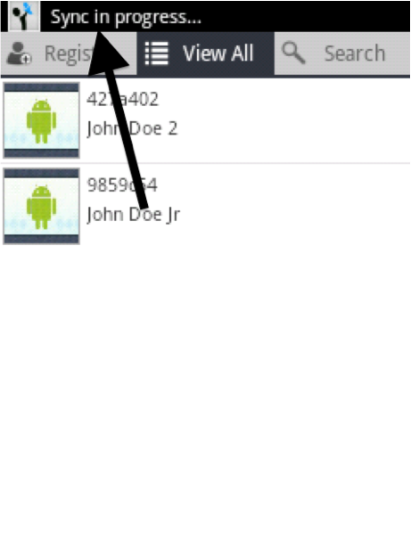

# Synchronizing

To synchronize records go to “View all” page and press “Menu” button (refer to device overview section) on the phone.

Tap “Synchronize All” to sync all your records with the computer.

Once you tap you will see “Sync in progress” on the top of the phone

