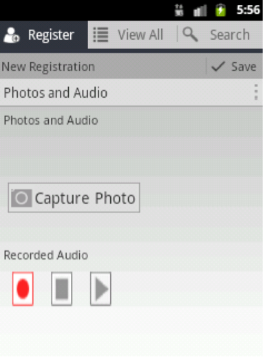
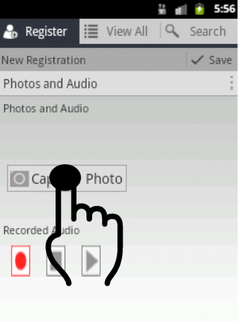
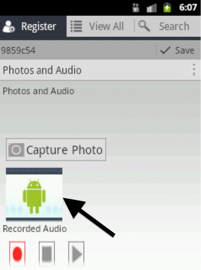

# Taking a child's photo

Navigate to the form section titled **“Photos and Audio”**.

Tap on “Capture Photo” to take the photo of the child.

You will be presented with an option to “Save” or “Discard” the photo. If you are not satisfied with the photo choose “Discard” to take another photo otherwise choose “Save”. Then you will see the photo on the page.

