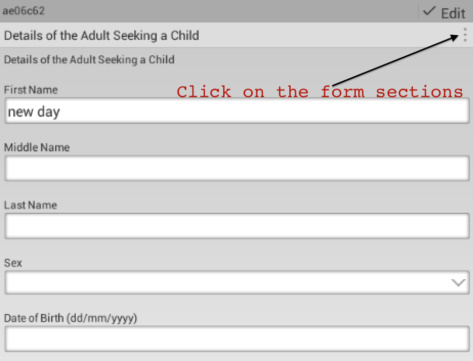
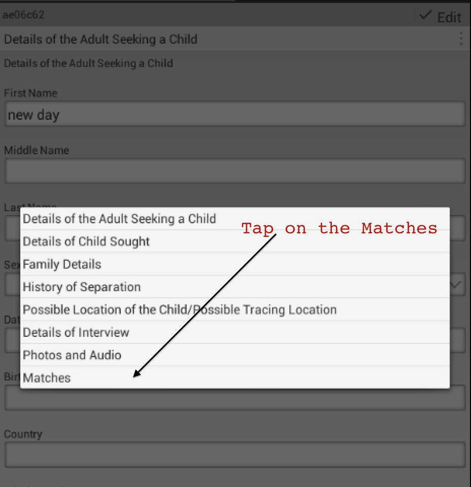
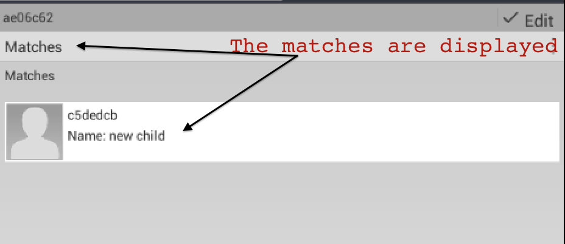
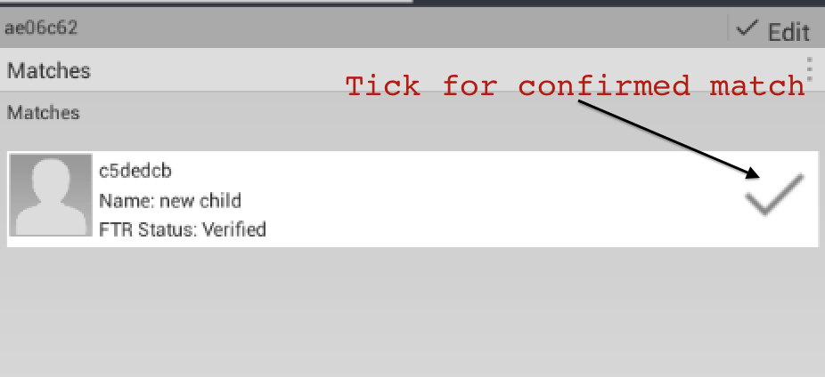

# Viewing matches

Go to a single record (either a child or enquiry).
Select to view the form sections

Then select the matches form section

Then the matches are displayed

If there is a confirmed match, then its displayed with a tick next to it

