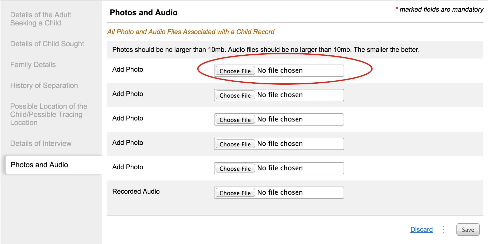
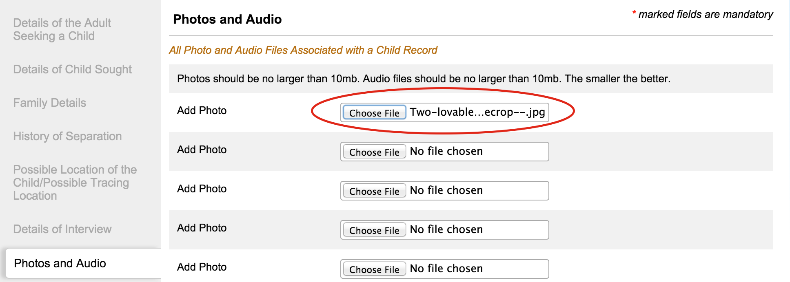

# Adding a photo to an enquiry

Navigate to the form section titled **“Photos and Audio”**.

Click on “Choose File” button to upload a photo of the child. Browse to the location of the child's photo on your computer and select the photo.

After adding the photo it will show the name of the photo to the box

In case this record is not correct, then again click on choose file to select a different photo.
