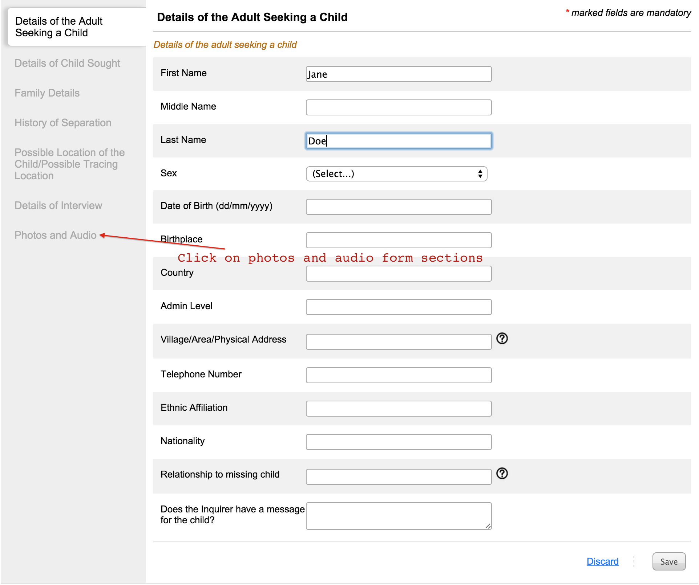
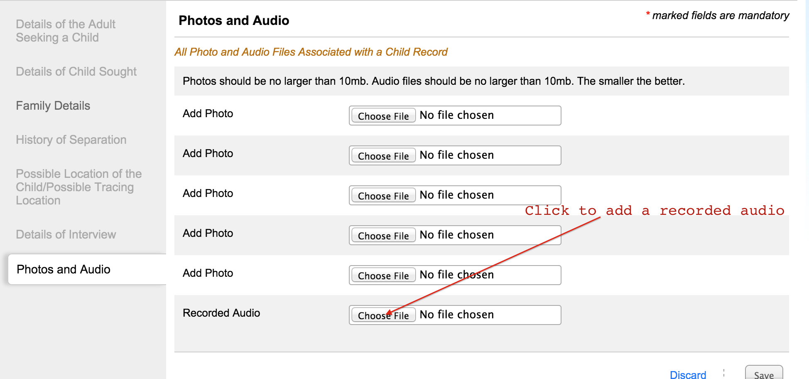
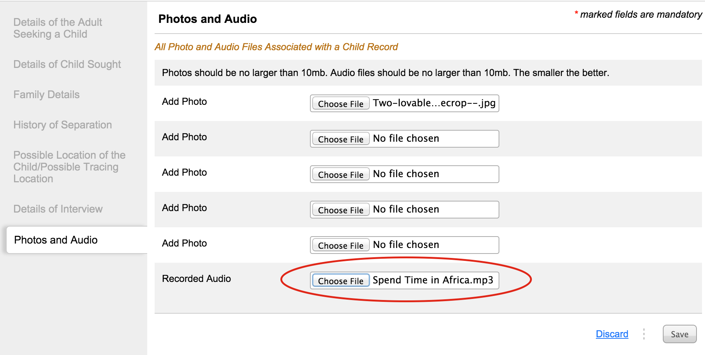

# Adding a recorded audio to an enquiry

Navigate to the form section titled **“Photos and Audio”**.

Click on “Choose File” button to upload an audio of a recording. Browse to the location of the child's audio on your computer and select it.

After adding the photo it will show the name of the audio to the box

In case this record is not correct, then again click on choose file to select a different audio.
