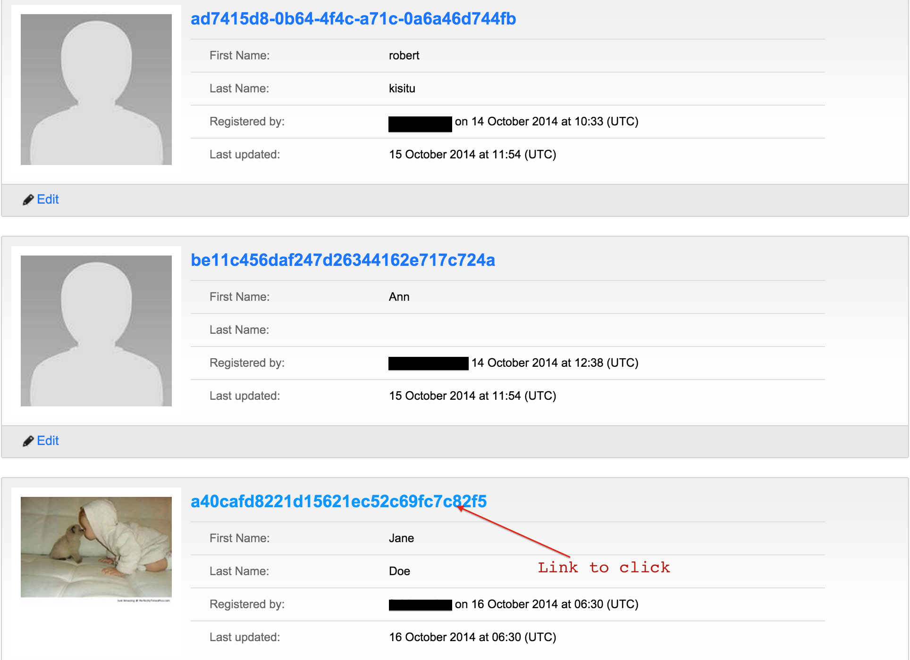
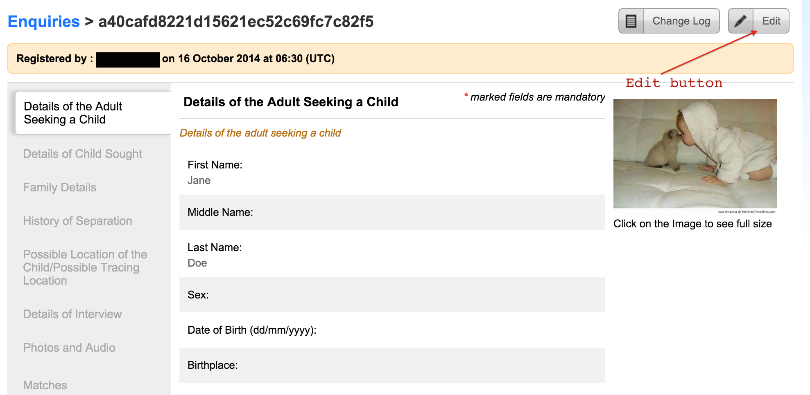
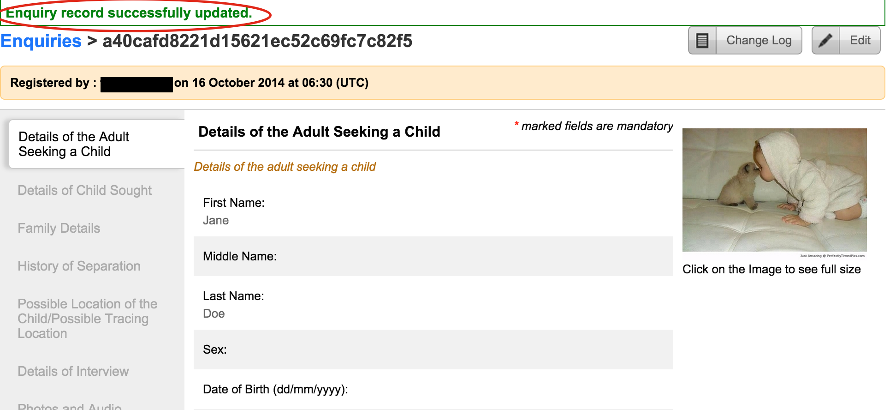

# Editing an enquiry

Navigate to the view all enquiry page and click on the link.

Tap “Edit” on the top right section of
the page to edit a record.

Make necessary changes and click on “Save” at the bottom of the page to save your changes.

After this then a page with a success message is shown.

