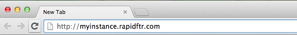
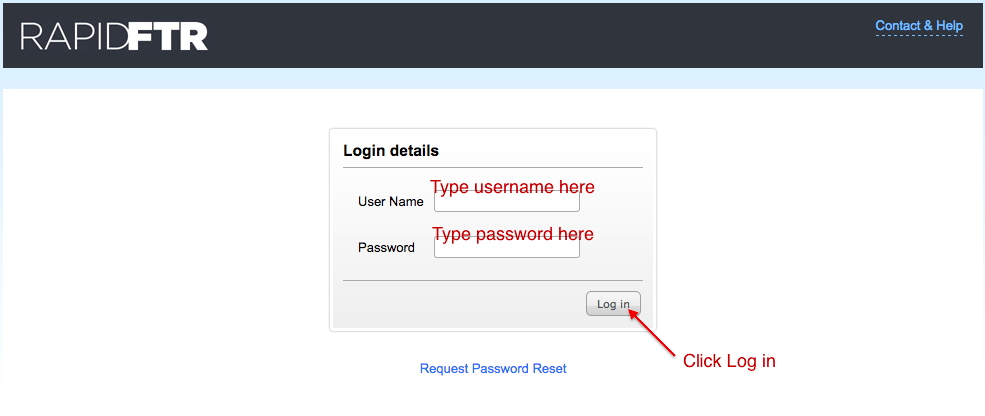
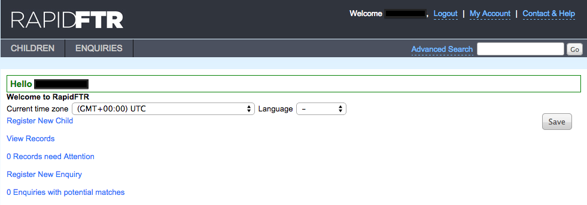

# Logging into RapidFTR

To start the application, enter the URL for your deployment as provided by your system administrator in your browser.

Once you enter the correct URL and press Go, you will see a login page with Username and Password fields. Then follow these steps:

1.	Type your username
2.	Type your password
3.	Press log in button

Once you successfully login, you will see the application and quick start menus on your screen.

