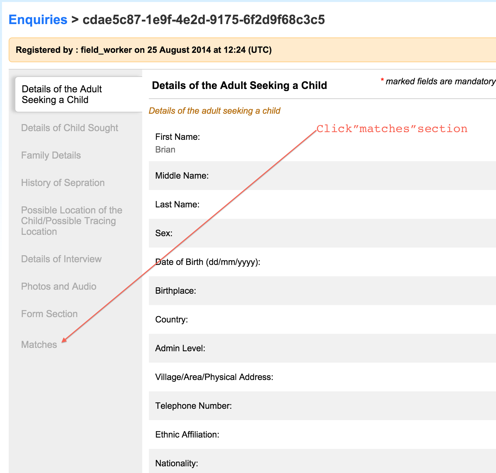
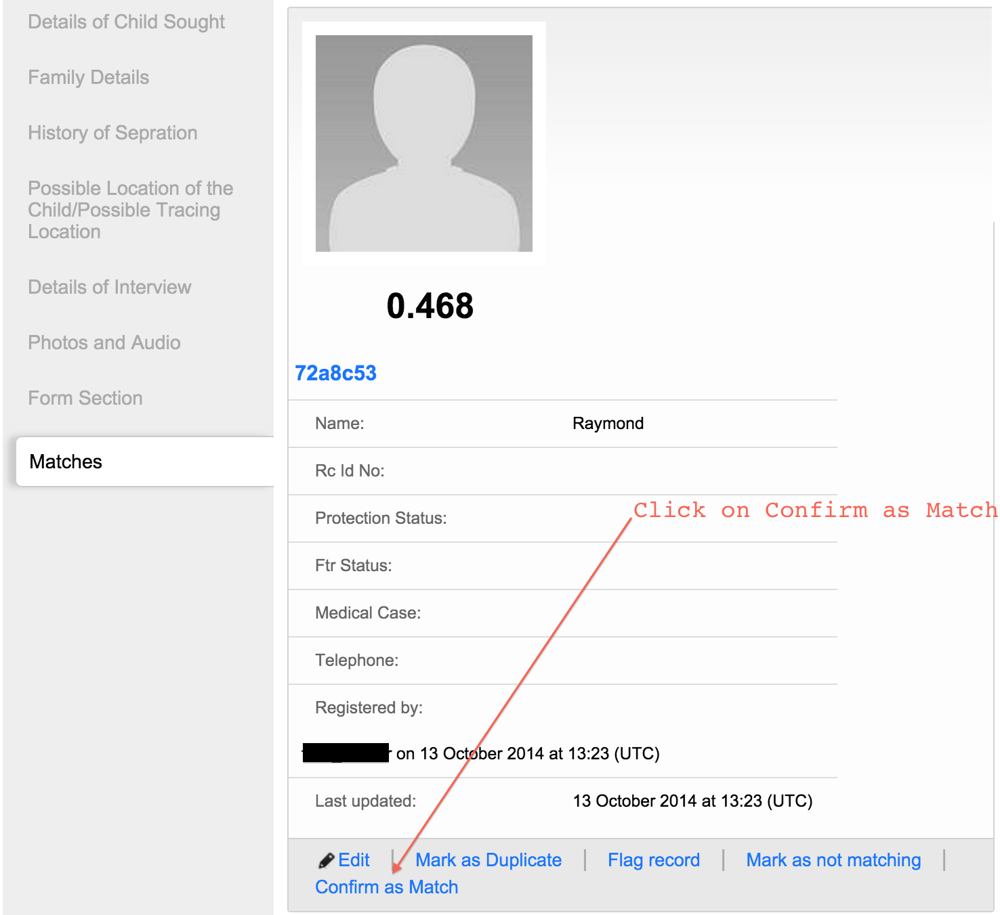
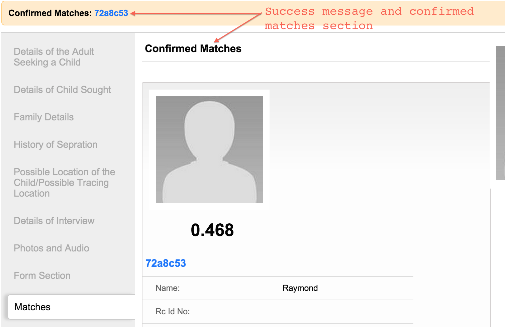

# Mark a child/enquiry as a "Confirmed Match"

This functionality can be used to either mark a child as a confirmed match to an enquiry or an enquiry a confirmed match to a child. Here we will use an example of a child being marked as a confirmed match, but the same can be applied to the enquiry.

To mark a child record as "Confirmed Match", navigate to the list of matches to the enquiry.

Click on the text "Mark as not matching" next to the record of the child you want to remove from the list of potential matches.

You will see a confirmed match id and a new section of confirmed matches.

