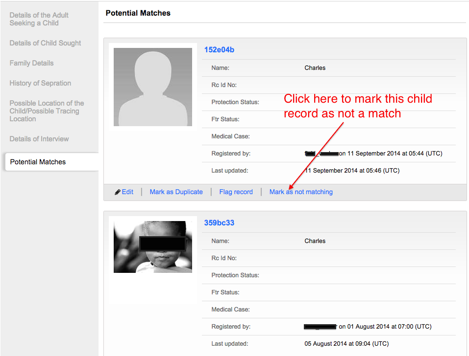

# Mark a child as "Not Matching" an enquiry

To mark a child record as "Not Matching", navigate to the list of potential matches to the enquiry.

Click on the text "Mark as not matching" next to the record of the child you want to remove from the list of potential matches.

You will see a success message at the top of the page, and the child record will no longer appear in the list of potential matches.

