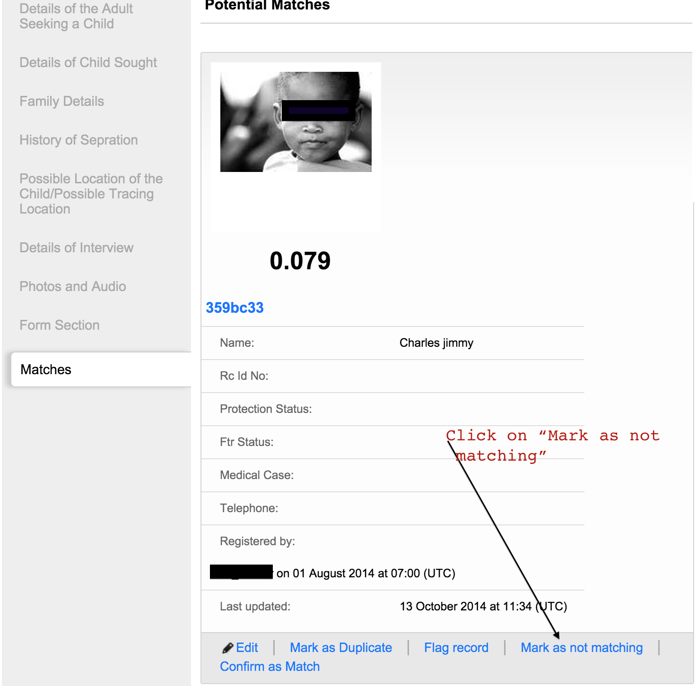
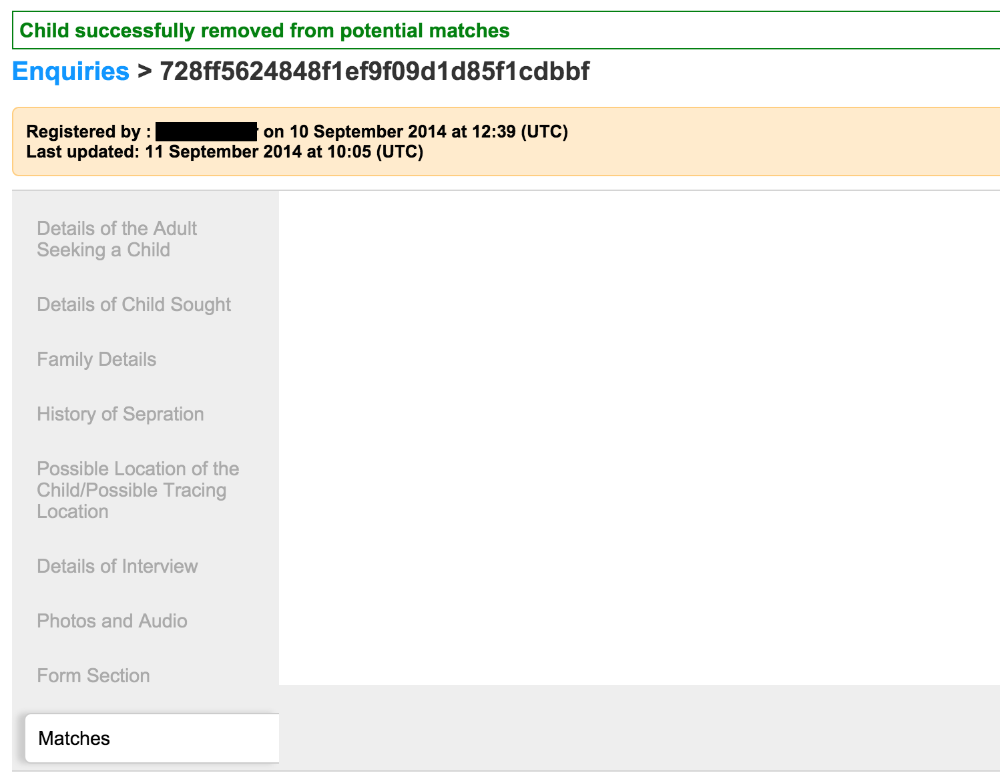

# Mark a child/enquiry as "Not Matching"

This functionality can be used to either mark a child as not matching an enquiry or an enquiry not matching a child. Here we will use an example of a child being marked as not a match, but the same can be applied to the enquiry.

To mark a child record as "Not Matching", navigate to the list of matches to the enquiry.

Click on the text "Mark as not matching" next to the record of the child you want to remove from the list of potential matches.

You will see a success message at the top of the page, and the child record will no longer appear in the list of potential matches.

