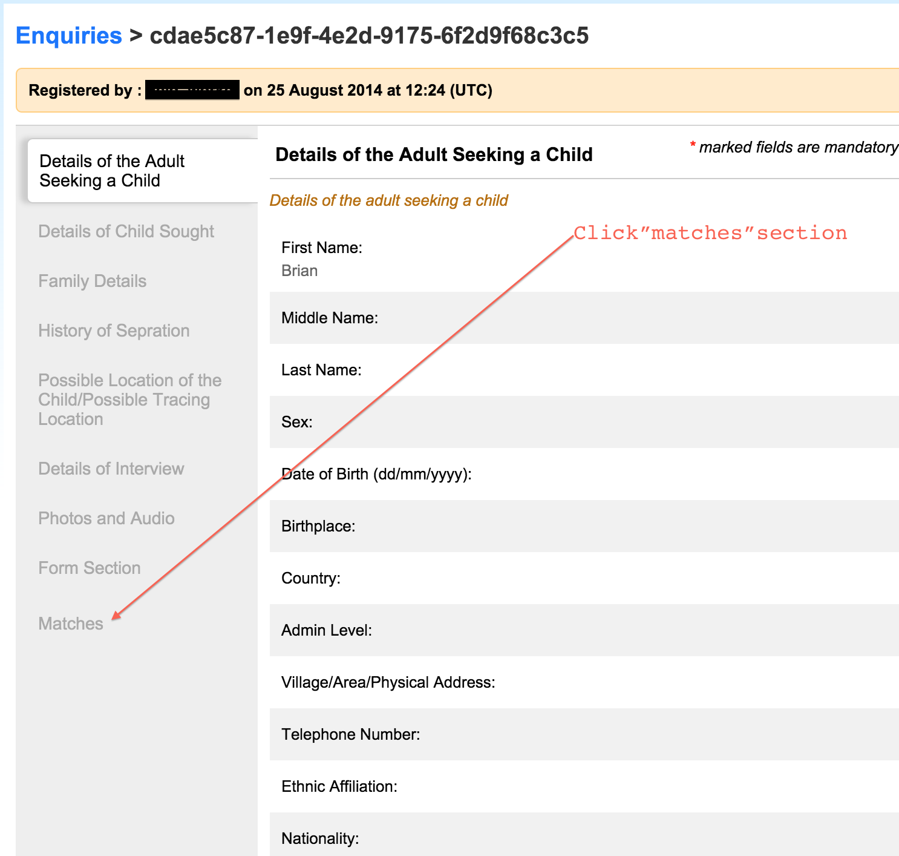

# Re-unification of a child to a confirmed enquiry

To mark a child as reunified with a confirmed match, navigate to the child page and click on the matches section.

Then click on the Mark as reunited button.

Then the Reunited details will come up, fill in any message that would be relevant to the reunification. then click on Reunited button to complete the action.

The reunification success page will be displayed.Now the Mark as reunited has changed to Mark as not reunited, there is a section for Reunited matches, and an orange flag to show reunification.

When back to view all the children page then a reunited child will have the flag to show that it is reunited.

