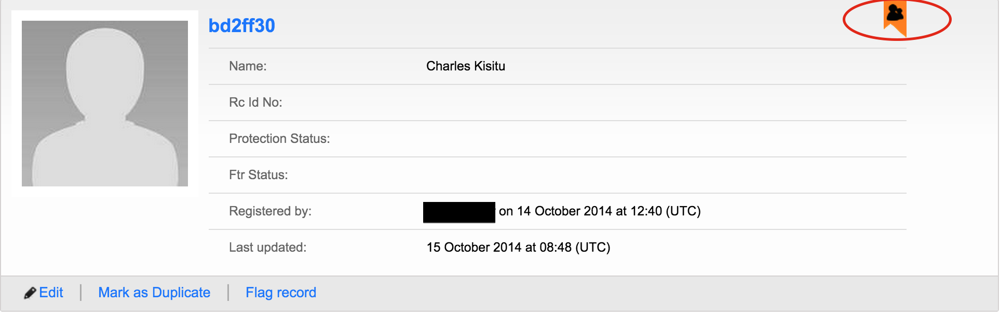

# Reunification of a child without a confirmed match

Sometimes a child can be reunited to a guardian who did not lodge an enquiry. In such a case, then we Mark as reunited (as in section 2.6.1 above). The difference is when we navigate to the matches of this reunited child the there is no category for reunited matches, but there is a flag to show that the child is reunited.

When we go to the view all children page then we can see the reunited child using the flag shown.

