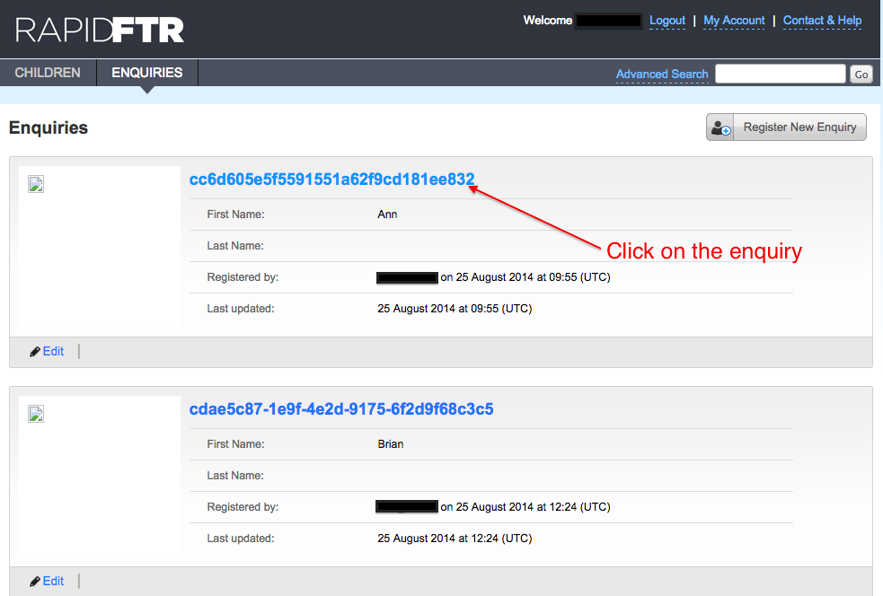
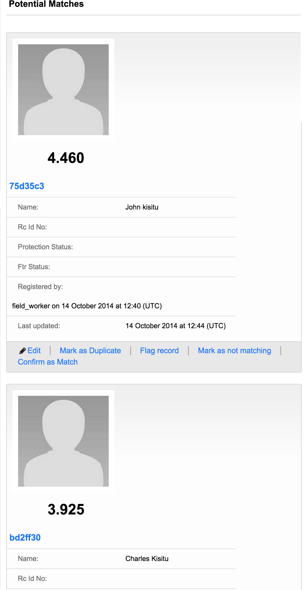

# View potential matches

To view the list of potential matches to an enquiry, click on the enquiry

Navigate and click on the section called **"Matches"**.

You will see a list of potential matching child records to the enquiry, ordered according to their relevance. Using the score displayed.

