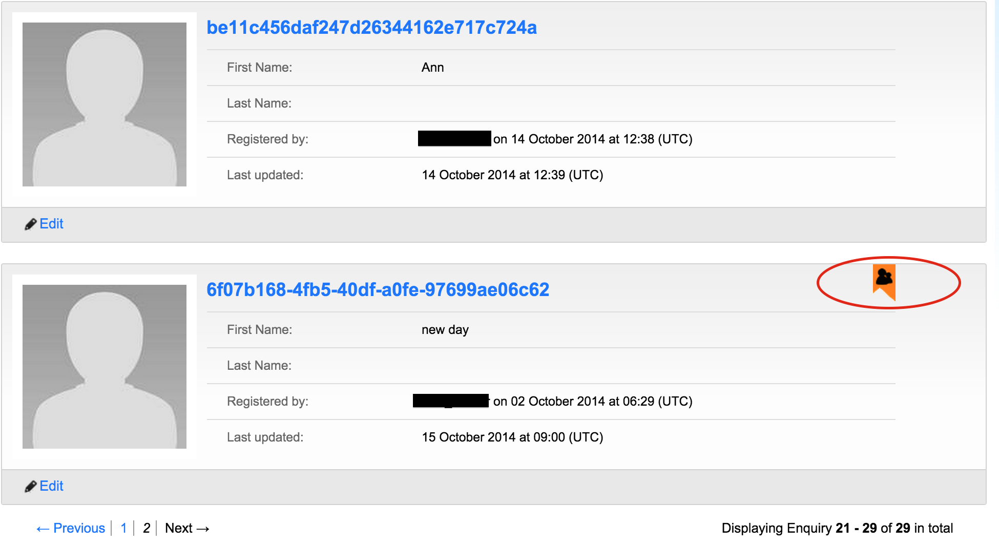
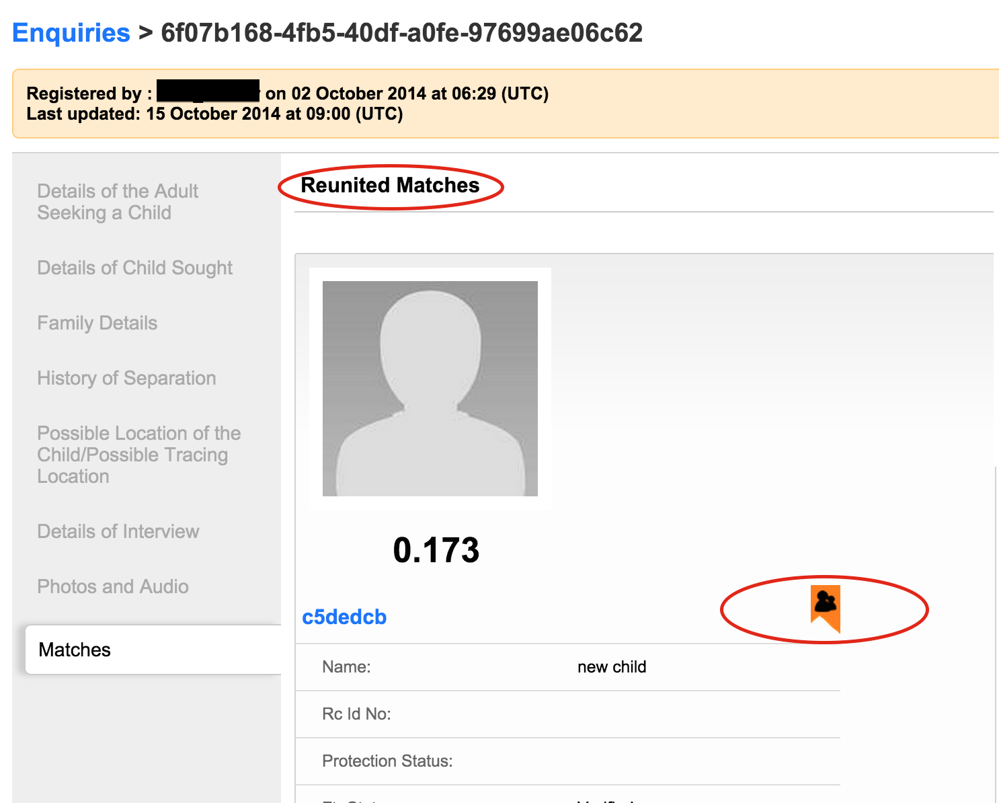

# Viewing a reunified enquiry

After an enquiry has been reunited to a child. When in the view all enquiry page then, it will be displayed with the same reunited flag as shown for the child.

Note that if you navigate to that particular enquiry, matches section, then there will only be the reunited match displayed.

