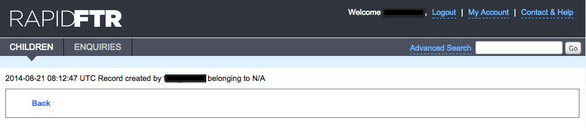

# Viewing Change Logs

To view a change log on any enquiry or child record, navigate to the detailed enquiry or child record. At the top of the page click on "Change Log" button.

You will see a description of all the changes which have been done on the child record.

In case you would like to view all the changes that you have done. You should click on My Account.

Then click on the user action history button.

Then you can view all the changes that you have done on any record as a user.

